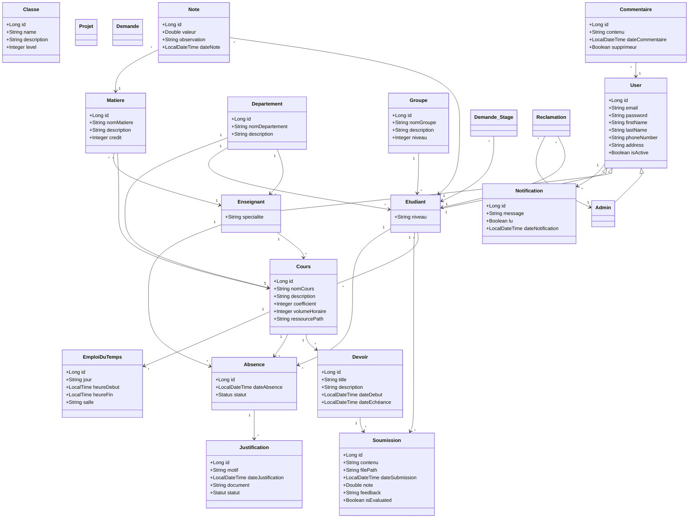

# Class Diagram (Frontend Reference)

This is a **high-level** Mermaid diagram based on the backend JPA entities and the implemented REST resources.

```mermaid
classDiagram
  class User {
    +Long id
    +String email
    +String password
    +String firstName
    +String lastName
    +String phoneNumber
    +String address
    +Boolean isActive
  }

  class Admin
  class Enseignant {
    +String specialite
  }
  class Etudiant {
    +String niveau
  }

  User <|-- Admin
  User <|-- Enseignant
  User <|-- Etudiant

  class Departement {
    +Long id
    +String nomDepartement
    +String description
  }

  class Groupe {
    +Long id
    +String nomGroupe
    +String description
    +Integer niveau
  }

  class Classe {
    +Long id
    +String name
    +String description
    +Integer level
  }

  class Cours {
    +Long id
    +String nomCours
    +String description
    +Integer coefficient
    +Integer volumeHoraire
    +String ressourcePath
  }

  class Devoir {
    +Long id
    +String title
    +String description
    +LocalDateTime dateDebut
    +LocalDateTime dateEchéance
  }

  class Soumission {
    +Long id
    +String contenu
    +String filePath
    +LocalDateTime dateSubmission
    +Double note
    +String feedback
    +Boolean isEvaluated
  }

  class Absence {
    +Long id
    +LocalDateTime dateAbsence
    +Status statut
  }

  class EmploiDuTemps {
    +Long id
    +String jour
    +LocalTime heureDebut
    +LocalTime heureFin
    +String salle
  }

  class Notification {
    +Long id
    +String message
    +Boolean lu
    +LocalDateTime dateNotification
  }

  class Projet
  class Demande

  class Matiere {
    +Long id
    +String nomMatiere
    +String description
    +Integer credit
  }

  class Note {
    +Long id
    +Double valeur
    +String observation
    +LocalDateTime dateNote
  }

  class Justification {
    +Long id
    +String motif
    +LocalDateTime dateJustification
    +String document
    +Statut statut
  }

  class Commentaire {
    +Long id
    +String contenu
    +LocalDateTime dateCommentaire
    +Boolean supprimeur
  }

  class Demande_Stage
  class Reclamation

  %% Relations (simplified)
  Departement "1" --> "*" Enseignant
  Departement "1" --> "*" Etudiant
  Departement "1" --> "*" Cours

  Groupe "1" --> "*" Etudiant

  User "1" --> "*" Notification

  Enseignant "1" --> "*" Cours
  Cours "1" --> "*" Devoir
  Devoir "1" --> "*" Soumission

  Etudiant "*" -- "*" Cours
  Etudiant "1" --> "*" Soumission

  Cours "1" --> "*" Absence
  Etudiant "1" --> "*" Absence
  Enseignant "1" --> "*" Absence

  Cours "1" --> "*" EmploiDuTemps

  Matiere "*" --> "1" Cours
  Matiere "*" --> "1" Enseignant
  Note "*" --> "1" Etudiant
  Note "*" --> "1" Matiere

  Absence "1" --> "*" Justification

  Commentaire "*" --> "1" User

  Reclamation "*" --> "1" Etudiant
  Reclamation "*" --> "1" Admin

  Demande_Stage "*" --> "1" Etudiant
```
